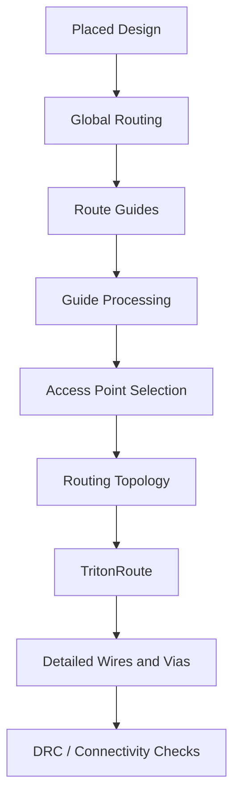
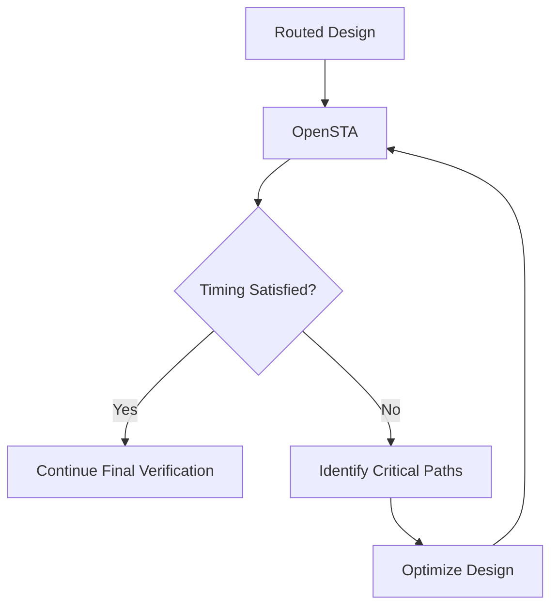

# PHYSICAL-DESIGN-DAY5

# — Routing, TritonRoute and OpenSTA

## Overview

After placement and clock tree synthesis, the physical design is still not complete. The cells have been positioned, but the actual electrical connections between them have to be created.

This stage is called **routing**.

Routing connects the required pins and nets using the available metal layers and vias while following the design rules of the technology. After routing, the design is checked for physical violations and its timing is analyzed using Static Timing Analysis.

The main topics covered in this module are:

* Maze routing and Lee's algorithm
* Routing grids
* Placement and routing blockages
* Metal width, pitch and spacing
* Vias and via rules
* Global and detailed routing
* TritonRoute
* Route guides
* Inter-guide connectivity
* Access points
* Routing topology
* Design Rule Checking
* OpenSTA
* Setup and hold timing
* Post-route timing analysis

---

## 1. Where Routing Fits in the RTL-to-GDS Flow

Routing comes after placement and clock-tree synthesis.

```text
RTL
  |
  v
Synthesis
  |
  v
Floorplanning
  |
  v
Placement
  |
  v
Clock Tree Synthesis
  |
  v
Global Routing
  |
  v
Detailed Routing
  |
  v
DRC / Connectivity Checks
  |
  v
Static Timing Analysis
  |
  v
Final Verification
  |
  v
GDSII
```

The important point is that routing is not simply drawing wires between cells. The router has to work within limited physical resources while maintaining connectivity and satisfying technology rules.

---

# 2. Understanding Routing

Routing is the process of establishing physical connections between the required source and destination points.

A simple representation is:

```text
Source
  |
  |
  +--------------------+
                       |
                       v
                     Target
```

In an actual chip, the router has to deal with:

* Existing cells
* Macros
* Blockages
* Multiple metal layers
* Vias
* Congestion
* Minimum spacing
* Minimum width
* Connectivity requirements

So the objective is to find a valid physical path rather than simply the shortest visible path.


---

# 3. Maze Routing

One way to understand routing is to treat the chip as a grid.

The router starts from a source location and searches through available grid locations until it reaches the target.

The basic process is:

```text
Source
  |
  v
Explore neighbouring locations
  |
  v
Avoid blocked locations
  |
  v
Continue searching
  |
  v
Reach target
  |
  v
Trace the final route
```

This type of routing problem is known as **maze routing**.

---

# 4. Lee's Algorithm

Lee's algorithm is a classical grid-based approach to maze routing.

The routing area is divided into grid locations. The algorithm expands from the source and assigns increasing values to reachable locations.

For example:

```text
       1
       |
       2
       |
       3
       |
       4
```

The basic procedure is:

1. Start from the source.
2. Examine neighbouring grid locations.
3. Assign increasing values.
4. Avoid blocked locations.
5. Continue the search until the target is reached.
6. Trace backward from the target to obtain the route.

The algorithm is useful for understanding the basic path-search problem behind physical routing.

---

# 5. Routing Grid

A routing grid divides the available area into a set of possible routing locations.

```text
+---+---+---+---+---+
|   |   |   |   |   |
+---+---+---+---+---+
|   |   | X |   |   |
+---+---+---+---+---+
| S |   | X |   | T |
+---+---+---+---+---+
|   |   |   |   |   |
+---+---+---+---+---+
```

Here:

* `S` represents the source.
* `T` represents the target.
* `X` represents an unavailable location.

The router searches through the available locations while avoiding obstacles.


---

# 6. Placement Blockages

The router cannot use every part of the chip.

Macros, existing structures and restricted regions can act as blockages.

For example:

```text
Source
  |
  |
  |       BLOCKAGE
  |     ███████████
  |     ███████████
  |           |
  |           |
  +-----------+---------- Target
```

The routing engine has to find another path around the blocked region.

This is one reason why physical routing becomes more complicated as the design becomes larger and more congested.

---

# 7. Design Rule Checking

The physical layout has to follow the rules defined by the target technology.

This verification process is called **Design Rule Checking (DRC)**.

Some important routing-related rules include:

* Minimum metal width
* Metal spacing
* Metal pitch
* Via width
* Via spacing
* Layer-specific restrictions
* Connectivity rules

A simplified view is:

```text
               DRC
                |
      +---------+---------+
      |         |         |
    Width    Spacing     Via
      |         |         |
      +---------+---------+
                |
          Valid Layout
```

---

# 8. Metal Width

Metal width is the physical width of a routing wire.

```text
        Metal Wire
┌──────────────────────┐
│                      │
└──────────────────────┘
        <--- W --->
```

The minimum allowed width depends on the technology.

If the width is smaller than the permitted value, the layout may produce a DRC violation.

---

# 9. Metal Pitch and Spacing

**Spacing** is the distance between neighbouring wires.

```text
┌──────────────────────┐
│       Wire 1         │
└──────────────────────┘

        Spacing

┌──────────────────────┐
│       Wire 2         │
└──────────────────────┘
```

**Pitch** describes the repeated distance between corresponding positions of neighbouring routing tracks.

These rules are important because wires cannot be placed arbitrarily close to each other.

Insufficient spacing can lead to physical-rule violations and, in some cases, unwanted electrical connections.

---

# 10. Vias

A via is used when a signal needs to move from one metal layer to another.

```text
Metal Layer M2
────────────────────

        VIA
         |
         |
────────────────────
Metal Layer M1
```

Vias are therefore an essential part of multi-layer routing.

The router may change layers when:

* The current layer is blocked.
* Another route is occupying the required area.
* The preferred routing direction changes.
* A different layer provides a better path.


---

# 11. Via Width and Via Spacing

Vias also have their own technology rules.

### Via Width

The physical dimensions of the via have to satisfy the minimum allowed size.

### Via Spacing

Neighbouring vias must maintain the required separation.

```text
Via 1                    Via 2
  □                        □

       <--- spacing --->
```

Incorrect via dimensions or spacing can cause DRC violations.


---

# 12. Avoiding Signal Shorts

A signal short occurs when two signals that should remain electrically separate become unintentionally connected.

Possible causes include:

* Incorrect wire spacing
* Overlapping routes
* Incorrect via placement
* Improper layer usage
* Routing through restricted regions

One possible solution is to move a connection to another metal layer.

```text
Metal M1
───────────────
      |
     Via
      |
───────────────
Metal M2
```

Using multiple layers gives the router more freedom to avoid obstacles and maintain separation.

---

# 13. Power Distribution

Routing is also related to power distribution.

A typical physical design can contain:

* I/O pads
* Core area
* Standard-cell rows
* Power rings
* Power stripes
* Macros

A simplified view is:

```text
+--------------------------------+
|            I/O Pads            |
|  +--------------------------+  |
|  |       Power Ring         |  |
|  |                          |  |
|  |     Standard Cell Core   |  |
|  |      |  |  |  |  |      |  |
|  |      Power Stripes       |  |
|  |                          |  |
|  +--------------------------+  |
+--------------------------------+
```


---

# 14. Routing Commands

The current DEF being used by the flow can be checked with:

```tcl
echo $::env(CURRENT_DEF)
```

The power-distribution network can be generated using:

```tcl
gen_pdn
```

The routing stage can then be initiated with:

```tcl
run_routing
```

The exact commands can depend on the OpenLane version and configuration.

---

# 15. Global Routing and Detailed Routing

Routing can be broadly divided into two stages:

```text
Routing
   |
   +---------------------+
   |                     |
   v                     v
Global Routing      Detailed Routing
   |                     |
General Path          Exact Geometry
   |                     |
   +----------+----------+
              |
              v
        Final Routes
```

Global routing determines the general path and routing resources.

Detailed routing converts that information into actual physical wires and vias.


---

# 16. Fast Route / Global Route

The global-routing stage creates an initial routing solution.

Its main purpose is to determine:

* General routing paths
* Routing regions
* Preferred layers
* Approximate routing resources
* Routing guides

The resulting information is passed to the detailed-routing stage.

```text
Placed Design
     |
     v
Global Route
     |
     v
Route Guides
     |
     v
Detailed Router
```

---

# 17. Detailed Routing with TritonRoute

**TritonRoute** is used for detailed routing in the OpenROAD physical-design flow.

It takes the available physical information and routing guides and determines the detailed wire and via structures.

```text
Global Routing
      |
      v
Route Guides
      |
      v
TritonRoute
      |
      v
Detailed Routing
      |
      v
Wires + Vias
```

The detailed router needs to maintain:

* Connectivity
* Route-guide requirements
* Design rules
* Layer restrictions
* Routing resources

---

# 18. Route Guides

Route guides provide the detailed router with information about the regions in which a particular net should be routed.

They act as a bridge between global routing and detailed routing.

```text
Global Router
     |
     v
Route Guides
     |
     v
TritonRoute
     |
     v
Detailed Route
```


---

# 19. Inter-Guide Connectivity

Different routing guides have to remain connected.

Connectivity can occur in two common situations:

### Same Metal Layer

Two guides can connect when their boundaries touch.

```text
Guide A ──────────────┐
                      │
                      └──────── Guide B
```

### Neighbouring Metal Layers

Guides on neighbouring layers can connect through an appropriate vertical overlap and via.

```text
Metal M2
──────────────────
        |
        | Via
        |
──────────────────
Metal M1
```

This allows a route to move between metal layers while maintaining connectivity.

---

# 20. Intra-Layer and Inter-Layer Routing

Routing can involve movement within the same metal layer as well as movement between different layers.

```text
Same Layer
     |
     v
Intra-Layer Routing
     |
     v
Parallel Operations


Different Layers
     |
     v
Inter-Layer Routing
     |
     v
Via-Based Connections
```


---

# 21. Access Points

An **Access Point (AP)** is a possible grid location where a routing connection can be established.

Access points are important when connecting:

* Cell pins
* Macro pins
* Different routing layers
* Routing guides

A simplified representation is:

```text
Upper Metal
──────────────────
       |
       | Access Point
       |
──────────────────
Lower Metal
```

The router selects suitable access points while considering connectivity and design rules.


---

# 22. Routing Topology

Routing topology describes how several required points are connected together.

For example:

```text
        AP1
         |
         |
AP2 -----+----- AP3
         |
         |
        AP4
```

A good topology should:

* Connect every required point.
* Avoid unnecessary wire length.
* Reduce excessive vias.
* Follow the routing guides.
* Respect physical design rules.

---

# 23. Minimum Spanning Tree Concept

A routing topology can be viewed as a graph in which access points are nodes and possible connections have associated costs.

For two access points:

```text
cost(i,j) = distance(APi, APj)
```

A minimum spanning tree can then be used to create a connected structure based on these costs.

The idea is:

```text
Access Points
      |
      v
Calculate Connection Costs
      |
      v
Build Connectivity Graph
      |
      v
Minimum Spanning Tree
      |
      v
Routing Topology
```

This helps explain how a router can construct an efficient connection structure rather than connecting every point independently.

---

# 24. Routing Topology and Optimization

The routing process has to balance several factors:

| Factor       | Why it matters                                       |
| ------------ | ---------------------------------------------------- |
| Wire length  | Affects delay and routing resources                  |
| Via count    | Adds physical complexity                             |
| Congestion   | Limits available routing space                       |
| Connectivity | Every required terminal must be connected            |
| Design rules | The final geometry must be manufacturable            |
| Metal layers | Different layers provide different routing resources |


---

# 25. TritonRoute Flow

The complete detailed-routing process can be summarized as:



---

# 26. Post-Route Verification

After detailed routing, the layout needs to be checked.

The major checks include:

```text
Detailed Route
      |
      +----> DRC
      |
      +----> Connectivity
      |
      +----> Signal Shorts
      |
      +----> Wire Rules
      |
      +----> Via Rules
      |
      +----> Timing
```

A design that is logically correct can still fail physical verification, so these checks are necessary before moving toward final layout generation.

---

# 27. OpenSTA

After routing, timing analysis becomes especially important because the physical interconnect now contributes to the timing of the circuit.

**OpenSTA** is a Static Timing Analysis tool that can be used to examine the timing of the implemented design.

The main timing information includes:

* Arrival time
* Required time
* Slack
* Setup timing
* Hold timing
* Clock paths
* Data paths

---

# 28. Static Timing Analysis

Static Timing Analysis evaluates timing paths without requiring exhaustive functional simulation.

A basic register-to-register path is:

```text
Launch Register
      |
      v
Combinational Logic
      |
      v
Interconnect
      |
      v
Capture Register
```

The timing engine determines whether the data can travel through the path within the required time.

---

# 29. Setup Timing

Setup analysis checks whether data reaches the capture register sufficiently before the active clock edge.

A simplified relationship is:

```text
Clock Period
    >
Clock-to-Q Delay
    +
Combinational Delay
    +
Interconnect Delay
    +
Setup Requirement
    +
Timing Margins
```

If the data arrives too late, the path can have a setup violation.

---

# 30. Hold Timing

Hold analysis checks the opposite condition.

After the active clock edge, the data must remain stable for the required hold interval.

```text
Clock Edge
     |
     |------ Hold Requirement ------|
     |
Data must remain stable
```

If new data reaches the capture element too early, a hold violation can occur.

---

# 31. Slack

Slack represents the timing margin available on a path.

For a simplified setup calculation:

```text
Slack = Required Time - Arrival Time
```

For example:

```text
Required Time = 5.0 ns
Arrival Time  = 4.6 ns

Slack = 5.0 - 4.6
      = +0.4 ns
```

Positive slack indicates available timing margin, while negative slack indicates that the corresponding timing requirement is not met.

---

# 32. Clock and Data Paths

STA considers both the clock and data paths.

```text
                Clock
                  |
          +-------+-------+
          |               |
          v               v
      Launch FF        Capture FF
          |               ^
          |               |
          +--> Data Path -+
```

The relationship between these paths affects the available timing window.

This is why routing, clock distribution and timing analysis are closely connected.

---

# 33. Post-Route Timing Flow

After detailed routing, the timing-analysis process can be represented as:

```text
Detailed Routing
      |
      v
Physical Interconnect
      |
      v
Parasitic Information
      |
      v
OpenSTA
      |
      +----------+
      |          |
      v          v
    Setup      Hold
      |          |
      +-----+----+
            |
            v
       Timing Report
            |
            v
      Optimization
```

---

# 34. Timing Closure

If timing violations are found, the design may need to be optimized and analyzed again.



Possible optimization methods include:

* Cell sizing
* Buffer insertion
* Placement improvement
* Routing improvement
* Logic optimization
* Clock optimization

---

# 35. Complete Routing and Timing Flow

```text
Placement
    |
    v
Clock Tree Synthesis
    |
    v
Global Routing
    |
    v
Route Guides
    |
    v
TritonRoute
    |
    v
Detailed Routing
    |
    v
DRC / Connectivity
    |
    v
Parasitic Information
    |
    v
OpenSTA
    |
    +------> Setup Analysis
    |
    +------> Hold Analysis
    |
    v
Timing Closure
    |
    v
Final Physical Verification
    |
    v
GDSII
```

---

# 36. Important Commands

### Check the current DEF

```tcl
echo $::env(CURRENT_DEF)
```

### Generate the power-distribution network

```tcl
gen_pdn
```

### Start routing

```tcl
run_routing
```

These commands are used as part of the physical-design flow, although the exact command sequence can vary depending on the OpenLane setup.

---

# 37. Key Learnings

The major concepts covered in this module are:

1. Routing converts logical connectivity into physical interconnections.
2. Maze routing can be understood as a grid-based path-search problem.
3. Lee's algorithm demonstrates how a route can be found while avoiding obstacles.
4. Routing grids provide the search space for the router.
5. Metal width and spacing are controlled by technology rules.
6. Vias allow signals to move between metal layers.
7. Global routing establishes the general routing structure.
8. Detailed routing creates the actual physical wires and vias.
9. TritonRoute performs detailed routing using routing information and guides.
10. Access points provide possible locations for establishing connections.
11. Routing topology determines how multiple terminals are connected.
12. DRC verifies that the physical layout follows technology rules.
13. OpenSTA checks timing after implementation.
14. Setup and hold checks examine different timing conditions.
15. Slack indicates the timing margin of a path.
16. Physical routing can affect timing through interconnect delay and parasitics.
17. Timing closure requires repeated analysis and optimization.

---

# 38. Final Understanding

The main idea from this module is that the physical-design process does not end after placement.

The design first needs a routing plan, followed by detailed physical connections. TritonRoute then creates the detailed routing while considering connectivity and physical constraints.

Once the routes are created, the layout is checked for DRC and connectivity issues. The physical interconnect also affects circuit timing, so post-route Static Timing Analysis is required.

The overall relationship is:

```text
Placement
   |
   v
Clock Tree
   |
   v
Global Routing
   |
   v
Detailed Routing
   |
   v
Physical Verification
   |
   v
OpenSTA
   |
   v
Setup / Hold Analysis
   |
   v
Timing Closure
   |
   v
GDSII
```

Routing therefore connects the physical implementation with the final timing and verification stages of the RTL-to-GDSII flow.

---

## Module Summary

| Stage            | Main Purpose                            |
| ---------------- | --------------------------------------- |
| Maze Routing     | Understand grid-based path finding      |
| Global Routing   | Determine general routing paths         |
| Route Guides     | Guide detailed routing                  |
| TritonRoute      | Generate detailed routes                |
| Access Points    | Establish possible connection locations |
| Routing Topology | Organize connections between terminals  |
| DRC              | Verify physical design rules            |
| OpenSTA          | Perform static timing analysis          |
| Setup Analysis   | Check late data arrival                 |
| Hold Analysis    | Check early data arrival                |
| Timing Closure   | Resolve remaining timing violations     |
| GDSII            | Final physical layout representation    |

---

## Final RTL-to-GDS Perspective


# Conclusion

Routing is the stage where the placed design is converted into a physically connected implementation.

Understanding routing grids, maze routing, metal layers, vias, route guides and access points makes the detailed-routing process easier to follow. TritonRoute then handles the detailed physical routing while maintaining the required connectivity and design constraints.

After routing, DRC and connectivity checks verify the physical implementation. OpenSTA provides the timing view of the routed design by checking data paths, clock paths, setup, hold and slack.

Together, routing and post-route timing analysis form an important part of the final stages of the RTL-to-GDSII flow.

